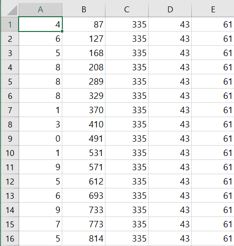

# Tensorflow-Object-Detection-API-Tutorial-train-optimize
[Tensorflow Object Dectection API](https://github.com/tensorflow/models/tree/master/research/object_detection)를 사용해 특정 객체 검출에 특화된 Detection 모델을 만들 수 있는 Tutorial입니다. 

# Summary
우리는 종종 높은 정확도를 조금 양보하더라도 **빠르고(fast) 가벼운(light) Detection 모델**을 원합니다. 또한 수십 개의 객체를 검출하기 보단, **특정 객체 몇 개를 정확하고 빠르게 검출**하기를 원합니다. 예를 들어 도로위의 차량과 사람, 신호등만을 검출하길 원하거나 신용 카드의 숫자를 검출하는 모델을 원하는 경우입니다.

이 튜토리얼은 Tensorflow Object Detection API를 사용해 사용자가 원하는 특정 객체를 검출하는 빠르고 가벼운 모델을 만들 수 있도록 도와줍니다. 그럼에도 높은 정확도를 유지할 수 있는 방법도 알려줍니다.

본 튜토리얼은 신용 카드 숫자 검출 모델 생성을 예시로 설명을 진행합니다.

**개발 환경**
* Ubuntu 16.04
* Python 3.6.6
* Tensorflow 1.9.0
* cuda 9.0

# Table of contents
1. [설치(Install)](#Install)
2. [데이터셋(Dataset) 구성](#Dataset)
>* Step 1. 학습 데이터 준비
>* Step 2. 데이터 라벨링
>* Step 3. csv 파일 생성
>* Step 4. TF Record 파일 생성
>* Step 5. label.pbtxt 파일 생성
3. [학습(Training)](#Train)
4. [모델 구동(Running)](#Running)
5. [결과(Result)](#Result)
6. [Extras](#Extras)

## 설치

[Tensorflow Object Dectection API](https://github.com/tensorflow/models/tree/master/research/object_detection)을 적당한 폴더에 git clone하고 [여기](https://github.com/tensorflow/models/blob/master/research/object_detection/g3doc/installation.md)를 참고하여 설치를 완료합니다. ( COCO API installation은 하지 않아도 튜토리얼을 진행하는데 문제는 없습니다. )

## 데이터셋 구성

### Step 1. 학습 데이터 준비

학습에 필요한 이미지 데이터를 준비한다.  관련 이미지는 Google 검색을 통해 다운로드하거나, 가지고 있는 이미지 파일을 사용하면 된다. 이미지에는 검출하고자 하는 객체가 존재해야 한다. 또한 [여기](https://github.com/tensorflow/models/blob/master/research/object_detection/g3doc/using_your_own_dataset.md)에서 알 수 있듯이 학습 시 사용할 이미지 데이터는 **RGB image로 jpeg나 png 포멧**이어야 한다.

본 튜토리얼에서 사용한 데이터셋은 **.png 파일과 .csv 파일이 한 쌍 씩** 이루고 있는데, 여기서 **.png 파일은 학습할 이미지 데이터**이며, **.csv 파일에는 이미지 안에 존재하는 객체에 대한 정보**( class, x, y, width, height )가 저장되어 있다. 

> **.csv 파일의 생성에 대한 설명은 Step 2. 데이터 라벨링 목록에서 한다.**

* 학습에 사용할 데이터셋 리스트

* 학습에 사용할 카드 이미지

* 학습에 사용할 데이터셋의 csv 포멧( 왼쪽부터 객체의 **class(숫자), x, y, width, height** )

### Step 2. 데이터 라벨링

Object Detection 모델을 학습하기 위해서는 이미지 데이터에 존재하는 객체에 **Labelling**을 하는 과정이 필요하다. 이와 관련한 많은 프로그램이 존재하지만 이 튜토리얼에선 github에 open source로 공개되어 있는 LabelImg를 사용하길 추천한다.

본 튜토리얼에서 제공받았다고 가정한 객체 정보는 .csv 파일로 존재하지만, 위 프로그램을 사용하여 라벨링을 진행했을 경우 결과는 XML 형식으로 얻게된다. 이는 [datitran](https://github.com/datitran/raccoon_dataset)의 github에 있는 xml_to_csv.py 소스를 사용해 간단하게 csv 파일로 변경 가능하다.

### Step 3. csv 파일 통합(Merge)

### Step 4. TF Record 파일 생성

Object Detection 모델을 학습시킬 때 마다 이미지와 .csv 파일을 한 쌍으로 데이터를 보관하고 이용하는 것은 비효율적이고 관리하기에도 좋지 않다. Tensorflow Object Detection API는 이를 해결하기 위해 이미지와 .csv 파일은 TFRecord라는 하나의 파일로 만드는 방법을 사용했습니다.

이 과정은 제공되는 소스코드를 사용하면 되지만 사용자의 데이터에 맞게 약간의 수정이 필요합니다. 

TFRecord에 대한 더 자세한 설명은 [여기](http://bcho.tistory.com/1190)를 참고하길 바랍니다.

### Step 5. label.pbtxt 파일 생성

## 학습

## 모델 구동

## 결과

## Extras
